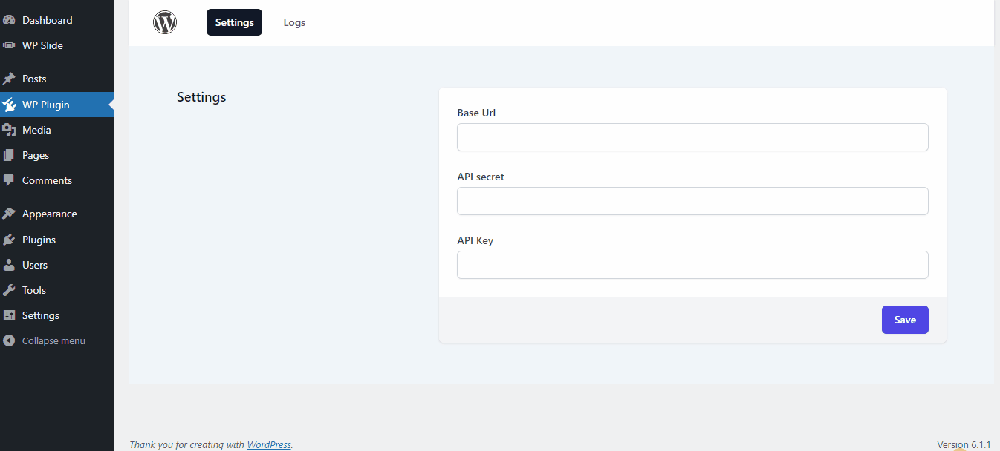
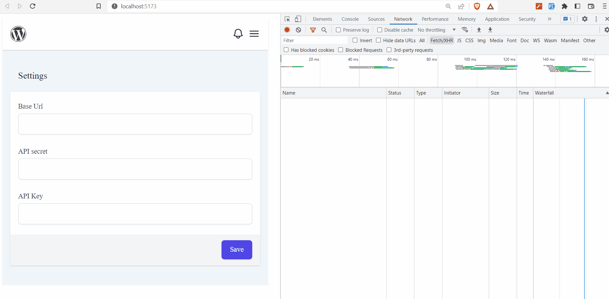

# WordPress Plugin #
**Contributors:** devkabir  
**Donate link:** https://example.com/  
**Tags:** wordpress, plugin  
**Requires at least:** 4.5  
**Tested up to:** 6.1.1  
**Requires PHP:** 5.6  
**Stable tag:** 1.0.0  
**License:** GPLv2 or later  
**License URI:** https://www.gnu.org/licenses/gpl-2.0.html

A simple WordPress plugin boilerplate

## Description ##

This is a foundation for building WordPress plugins. It provides a structured, organized and maintainable codebase for 
plugin developers to build upon. This boilerplate includes best practices for security, performance, and extensibility, 
as well as tools for testing and deployment. It follows the WordPress coding standards and is built using object-oriented 
design principles. By using this, developers can focus on building their plugin's unique functionality, rather than 
worrying about the underlying code structure.

### Technologies ###

- [**Vite**](https://vitejs.dev/) Next Generation Frontend Tooling.
- [**tailwindcss**](https://tailwindcss.com/) Rapidly build modern websites without ever leaving your HTML.
- [**vue.js**](https://vuejs.org/) The Progressive JavaScript Framework.
- [**Notyf**](https://github.com/caroso1222/notyf) A minimalistic JavaScript library for toast notifications.
- [**jQuery**](https://jquery.com/) A minimalistic JavaScript library for toast notifications.

### Features ###

- Check used [Technologies](#technologies) features.
- Can generate independent CSS rules for the frontend and admin that work with almost any theme without conflict.
- The frontend and backend teams can work on the same plugin at the same time without any issues.
- By using a bash script, you can create a WordPress.org build package. As a result, your source code and production code will be distinct.
- Jquery is supported by frontend scripts. If your developer is unfamiliar with vue.js, he can generate admin and website assets with jquery.
- Shortcode generator can collect assets dynamically. All you have to do is pass shortcode tag in Shortcode Class.
- It will remove all annoying admin notice from admin panel.
- It will load classes based on current screen of WordPress

## Requirements ##
- **node.js** v18.12.1
- **npm** v9.2.0
- **PHP** v5.6


## Installation ##

### For `PHP Developer`, ###

1. Go to your `plugins` folder of your local WordPress installation and run
```shell
composer create-project devkabir/wordpress-plugin your-plugin-name
```
2. run for open codes
```shell
cd your-plugin-name
code .
```
### For `Frontend Developer`, ###
1. For working on admin ui 
```shell
cd assets/admin
npm run dev
```
2. admin ui will open on `http://localhost:5173/`

The same goes for website assets

## Build and Deploy
1. Create a GitHub repository for production. You can add `GitHub action` to automate deployment of your plugin.
1. Run `deploy.sh` in your terminal.
1. Enter your github user name and the name of the repository you created in step 1.

It will clone your production repository and push the most recent code.

## Frequently Asked Questions ##
- [Network error from admin settings page](#network-error-from-admin-settings-page)
- [Shortcode render content on top of page](#shortcode-render-content-on-top-of-page)
- [How to change branch for production](#how-to-change-branch-for-production)
### Network error from admin settings page ###
You can enable cors or install a cors plugin on your development site. I am using [my plugin](https://wordpress.org/plugins/enable-cors-support) to deal with cores issues. This error will only show the creation stage.

### Shortcode render content on top of page ###
The theme causes this issue. Simply switch your theme to storefront or any other modern theme. You will notice a difference.

### How to change branch for production ###
Replace your branch name at `deploy.sh:32`

## Screenshots ##

### 1. Admin UI ###

### 2. CORS issue ###


